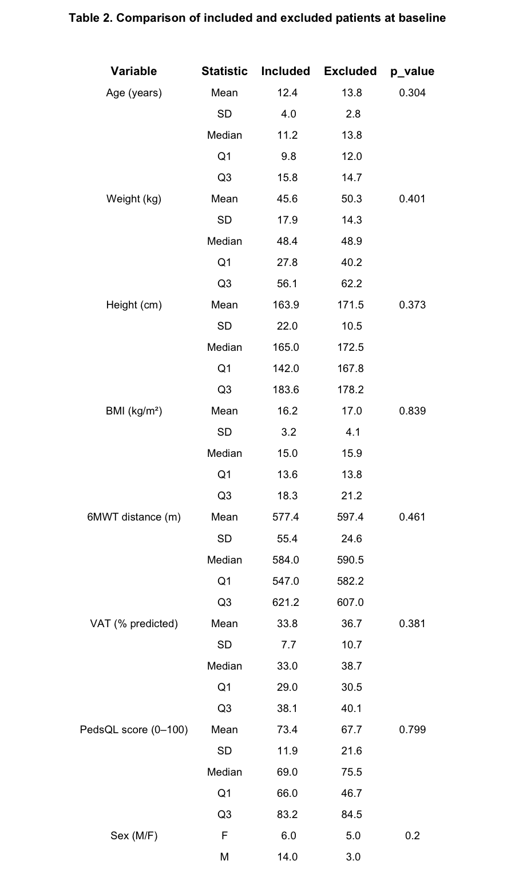
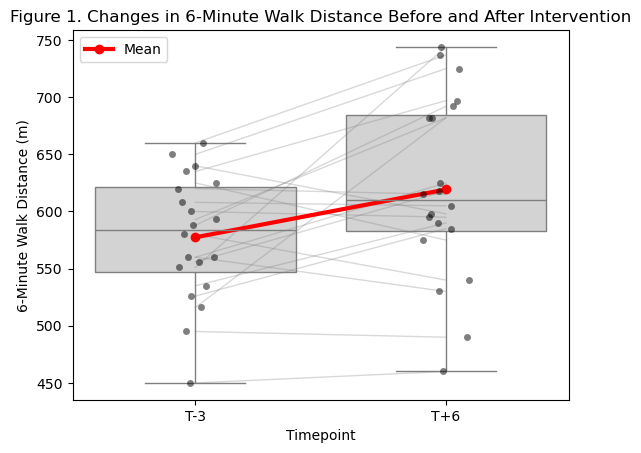
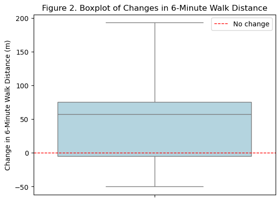
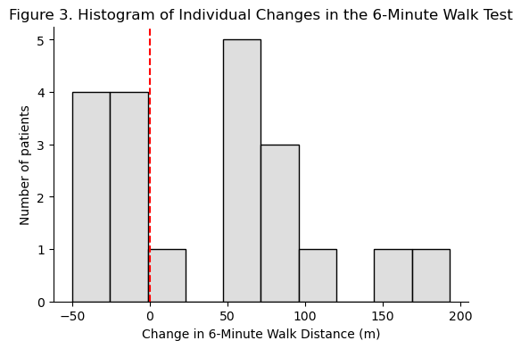
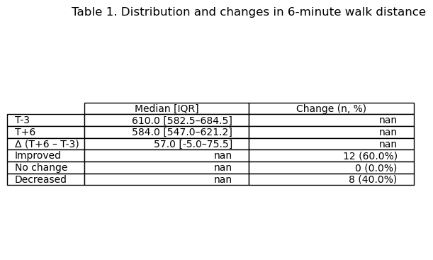
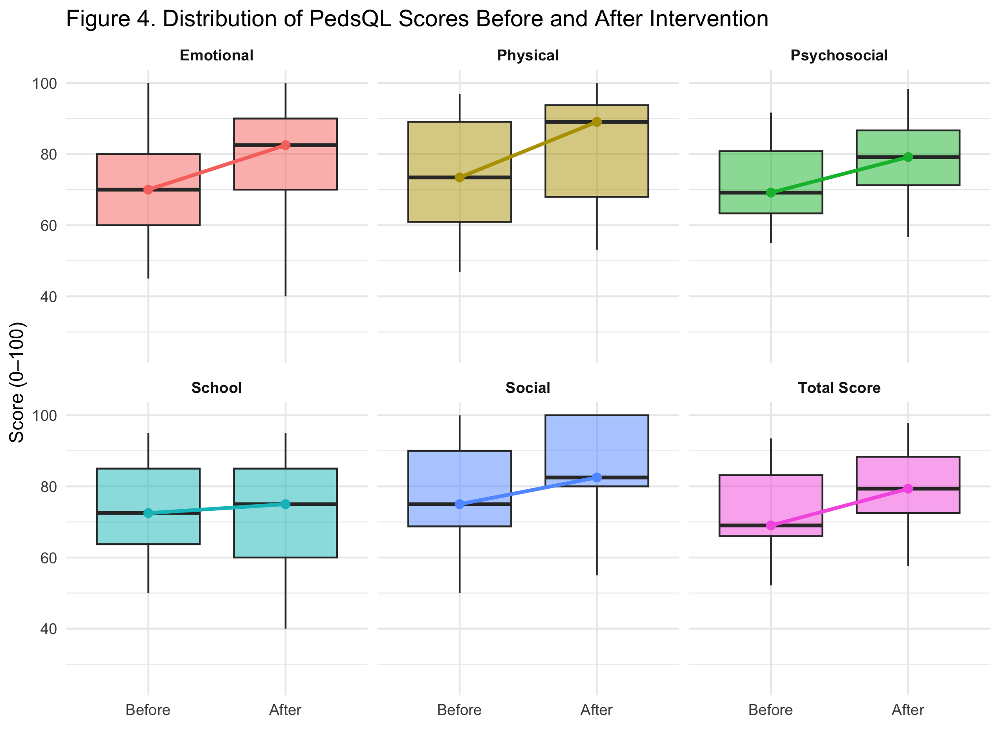
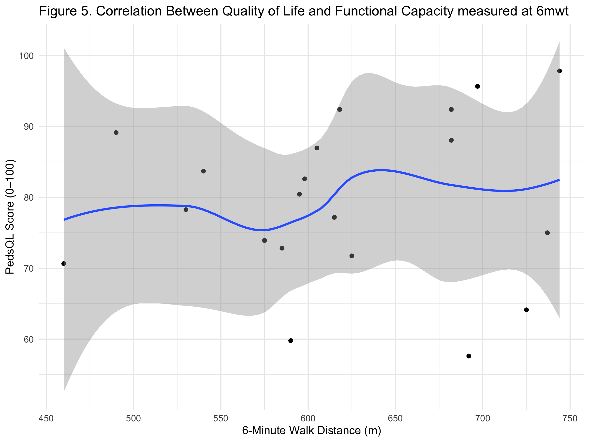

# 0. Project accessibility

The project is available on GitHub at this link: https://github.com/chloelaignel31-boop/Laignel.Chloe.git

# 1. Scientific problem

This project presents a secondary analysis of the Marfan Power dataset (Edouard et al., 2026), focusing on functional capacity and quality of life in children with Marfan syndrome.

## 1.1. Context

Marfan syndrome (MFS) is a rare genetic disorder affecting connective tissue, mainly involving the cardiovascular, musculoskeletal, and ocular systems. Aortic dilation is the most serious complication due to the risk of dissection (Milewicz et al., 2021).

Despite improvements in life expectancy, many patients still experience reduced physical capacity and chronic fatigue, negatively impacting their health-related quality of life (Goldfinger et al., 2017).

These limitations are partly explained by decreased muscle strength and reduced exercise tolerance (Jouini et al., 2024). Adapted physical activity is known to improve these parameters and is increasingly recommended in clinical management. However, due to cardiovascular risks, exercise must be carefully prescribed and individualized in this population (Peters et al., 2001).

Evidence on structured exercise programs in children with MFS remains limited. The Marfan Power study investigated a home-based adapted physical activity program and suggested improvements in functional capacity and quality of life, despite variable adherence and missing data (Edouard et al., 2026).

Research objective:
To evaluate changes in functional capacity using the 6-minute walk test (6MWT) and to explore its association with quality of life in children with Marfan syndrome.

## 1.2 Aim

The primary aim of this study was to assess changes in functional capacity following the intervention, using the 6-minute walk test (6MWT) as the primary outcome.

The secondary aim was to explore the relationship between functional performance and quality of life, assessed using the pediatric self-reported PedsQL questionnaire.

## 1.3 Method

### 1.3.1 Study design

This study is a secondary analysis of the Marfan Power dataset.
The original protocol included 3 months of observation followed by 3 months of intervention.

The present analysis focuses on a simplified before–after comparison using data collected at:

- baseline (T−3 months)
- post-intervention (T+6 months)

Functional capacity was assessed using the 6MWT and quality of life using PedsQL.

### 1.3.2 Study population

A total of 28 patients were initially included.

After applying inclusion criteria based on data completeness:

- 20 patients were included
- 8 were excluded (missing data or loss to follow-up)

## 1.4. Outcome measures

Functional capacity: 6-minute walk test (6MWT)

Quality of life: Pediatric Quality of Life Inventory (PedsQL)

## 1.5. Aim of the code

The objective of this code is to analyze changes in functional capacity using the 6-minute walk test (6MWT) before and after a 6-month adapted physical activity program. The analysis includes data preprocessing, visualization of individual and group-level changes, and statistical assessment using paired comparisons and correlation analysis with quality of life (PedsQL).

# 2. Data analysis pipeline

A structured data processing pipeline was implemented to ensure consistency, transparency, and reproducibility.

Python (data preprocessing and exploration):
- Data cleaning
- Computation of individual changes in 6-minute walk distance (6MWT)
- Exploratory visualizations
 
R (statistical analysis):
- Paired comparisons using the Wilcoxon test for 6MWT
- Exploratory visualization of PedsQL scores
- Correlation analysis between functional capacity (6MWT) and quality of life (PedsQL) using Spearman’s correlation

# 3. Results

## 3.1. Study population

The code used to generate Table 2 is available in Section 8 of the R notebook analysis_R.Rmd

```{r}

```

The study population was defined based on data completeness for the variables of interest at baseline (T−3) and post-intervention (T+6), resulting in the inclusion of 20 patients and the exclusion of 8 patients.

A comparison of baseline characteristics between included and excluded patients was performed to assess the potential presence of selection bias (Table 2). No statistically significant differences were observed between the two groups for any of the variables considered, including age (p = 0.304), weight (p = 0.401), height (p = 0.373), body mass index (p = 0.839), 6-minute walk distance (p = 0.461), ventilatory anaerobic threshold (p = 0.381), or PedsQL score (p = 0.799). Similarly, the distribution of sex did not differ significantly between groups (p = 0.20).

Overall, these results suggest that the included and excluded patients were comparable at baseline. Therefore, the exclusion of patients due to missing data is unlikely to have introduced a significant selection bias, supporting the validity and representativeness of the analytical sample.

## 3.2. Functional capacity (6MWT)

### 3.2.1 Data visualization and descriptive analysis is available in Section 6 of the Python notebook exploratory_analysis.ipynb


```{r}

```


```{r}

```


```{r}

```


```{r}

```


The exploratory analysis of functional capacity suggests an overall improvement in 6-minute walk distance following the intervention.

As shown in Figure 1, most individual trajectories display an upward trend between baseline (T−3) and post-intervention (T+6), indicating that the majority of patients increased their walking distance. This is further supported by the upward shift in central tendency, as illustrated by the mean values.

However, inter-individual variability is evident. While many patients improved, some exhibited little change or even a decrease in performance, highlighting heterogeneous responses to the intervention.

The distribution of individual changes (Figures 2 and 3) confirms this variability. The histogram, in particular, suggests a non-normal distribution, with an asymmetric spread and the presence of both positive and negative changes. This observation justifies the use of a non-parametric statistical approach.

Descriptive statistics (Table 1) support these findings. Although the median 6MWT distance slightly decreased between T−3 and T+6, the median individual change was positive (+57.0 m), and 60% of patients showed improvement, compared to 40% who experienced a decrease.

Given the non-normal distribution of the data and the relatively small sample size, a paired non-parametric test (Wilcoxon signed-rank test) was chosen to assess changes in functional capacity. This approach allows for a robust evaluation of before–after differences without assuming normality, while keeping the analysis simple and appropriate for the data structure.

Overall, these results suggest a positive trend in functional capacity following the intervention, which will be further evaluated through statistical analysis.


### 3.2.2 Sattiscal analysis for the Wilcoxon test and Spearman correlation is available in Section 9 of the R notebook analysis_R.Rmd


```{r}
cat(readLines("results/wilcoxon_test_results.txt"), sep = "\n")
```


The paired Wilcoxon signed-rank test revealed a statistically significant difference in 6-minute walk distance between baseline (T−3) and post-intervention (T+6) (V = 170, p = 0.016).

This result indicates that the observed changes in functional capacity are unlikely to be due to chance and support the hypothesis of an effect of the intervention.

This statistical finding is consistent with the graphical analysis. As shown in Figure 1, most individual trajectories display an increase in walking distance. Similarly, the distribution of individual changes (Figures 2 and 3) is predominantly shifted above zero, indicating that the majority of patients improved.

Despite some inter-individual variability, with a minority of patients showing no improvement or a decrease, the overall trend remains positive. The combination of graphical exploration and statistical testing therefore supports the conclusion of a significant improvement in functional capacity following the intervention.

## 3.3. Quality of life (PedsQL)

### 3.3.1 Data visualization and descriptive analysis is available in Section 10 of the R notebook analysis_R.Rmd

```{r}

```

The boxplots show relatively high PedsQL scores across all dimensions at both time points, with moderate inter-individual variability. The dispersion appears comparable across domains, although some differences in spread are observed.

Across all dimensions, median scores tend to be higher after the intervention compared to baseline. This pattern suggests a global improvement in perceived quality of life, although the magnitude of change varies between domains, with more pronounced shifts in physical and social dimensions.

Despite this overall positive trend, variability within each dimension remains substantial, indicating heterogeneous individual responses. This highlights the influence of individual factors on patient-reported outcomes and supports the multidimensional nature of quality of life.

Overall, this descriptive analysis suggests a general improvement in quality of life following the intervention, while emphasizing inter-individual variability. These observations will be further explored through correlation analyses with functional capacity.

### 3.3.2 Statistical analysis of the correlation between functional capacity and quality of life is available in Section 11 of the R notebook analysis_R.Rmd

```{r}

```


```{r}
cat(readLines("results/spearman_correlation_results.txt"), sep = "\n")
```
The relationship between functional capacity and quality of life was assessed using Spearman’s rank correlation coefficient. The analysis revealed a weak positive correlation between 6-minute walk distance and PedsQL score (ρ = 0.19), which was not statistically significant (p = 0.43) .

The graphical representation supports this finding. The scatter plot shows a wide dispersion of data points across the range of values, with no clear monotonic pattern. Although a slight upward trend can be visually suggested, the loess smoothing curve remains relatively flat, indicating the absence of a strong or consistent association.

Furthermore, the broad confidence interval around the smoothing curve reflects substantial inter-individual variability and a high degree of uncertainty in the estimated relationship. This variability suggests that functional capacity alone does not adequately explain differences in perceived quality of life within this sample.

Overall, both the graphical and statistical analyses converge to indicate the absence of a meaningful association between 6MWT performance and quality of life. These results highlight the multifactorial nature of quality of life and suggest that factors beyond physical performance may play a significant role in patient-reported outcomes.


# 4. Conclusion

This study aimed to evaluate changes in functional capacity following an adapted physical activity intervention and to explore its relationship with quality of life.

Baseline comparisons between included and excluded patients showed no significant differences in demographic or clinical characteristics, suggesting a low risk of selection bias and supporting the validity of the analytical sample.

A significant improvement in functional capacity was observed after the intervention, as demonstrated by the increase in 6-minute walk distance and confirmed by the Wilcoxon signed-rank test (p = 0.016). Despite this overall improvement, inter-individual variability in response was noted.

In contrast, the association between functional capacity and quality of life was weak and not statistically significant (Spearman’s ρ = 0.19, p = 0.43), indicating that improvements in physical performance were not directly reflected in self-reported quality of life.

Overall, these findings suggest that the intervention may effectively improve functional capacity, while its impact on perceived quality of life remains uncertain. This discrepancy likely reflects the multifactorial nature of quality of life, which cannot be explained by physical performance alone.

Finally, the relatively small sample size may have limited the statistical power to detect associations. Further studies with larger cohorts are needed to better understand the relationship between functional capacity and quality of life and to confirm these findings.


# 5. References

Edouard, T., Bajanca, F., Flumian, C., et al. (2026). *A personalized home-based exercise training program in children with Marfan and Loeys-Dietz syndromes improves aerobic exercise capacity and health-related quality of life*.
https://pmc.ncbi.nlm.nih.gov/articles/PMC12958747/

Edouard, T., Picot, M.-C., Bajanca, F., Huguet, H., Guitarte, A., Langeois, M., Chesneau, B., Khau Van Kien, P., Garrigue, E., Dulac, Y., & Amedro, P. (2024). *Health-related quality of life in children and adolescents with Marfan syndrome or related disorders: a controlled cross-sectional study*.
https://pmc.ncbi.nlm.nih.gov/articles/PMC11059743/

Peters, K. F., Horne, R., Kong, F., Francomano, C. A., & Biesecker, B. B. (2001). *Living with Marfan syndrome II. Medication adherence and physical activity modification*.
https://pubmed.ncbi.nlm.nih.gov/11683774/

Milewicz, D. M., Braverman, A. C., De Backer, J., Morris, S. A., Boileau, C., Maumenee, I. H., Jondeau, G., Evangelista, A., & Pyeritz, R. E. (2021). *Marfan syndrome*.
https://pmc.ncbi.nlm.nih.gov/articles/PMC9261969/

Jouini, S., Milleron, O., Eliahou, L., Jondeau, G., & Vitiello, D. (2024). *Online personal training in patients with Marfan syndrome: A randomized controlled study of its impact on quality of life and physical capacity*. 
https://pmc.ncbi.nlm.nih.gov/articles/PMC11681478/

Goldfinger, J. Z., Preiss, L. R., Devereux, R. B., Roman, M. J., Hendershot, T. P., Kroner, B. L., & Eagle, K. A. (2017). *Quality of life and associated factors in patients with Marfan syndrome: The GenTAC registry*.
https://pmc.ncbi.nlm.nih.gov/articles/PMC5519341/


