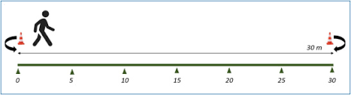
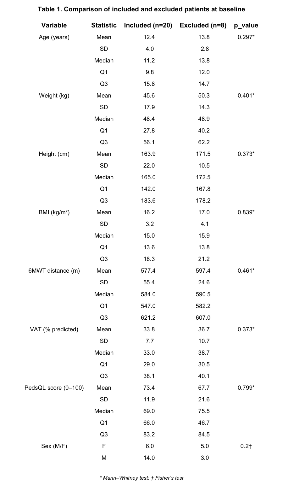
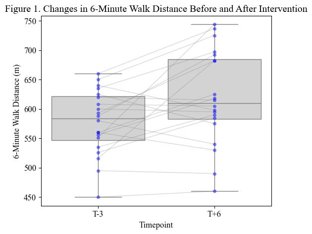
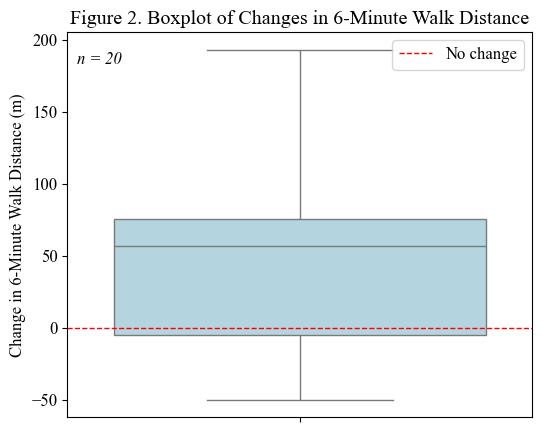
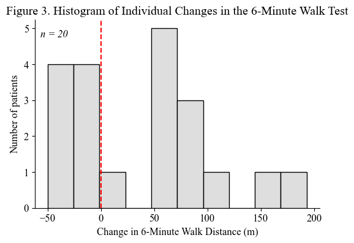
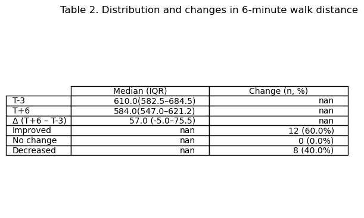
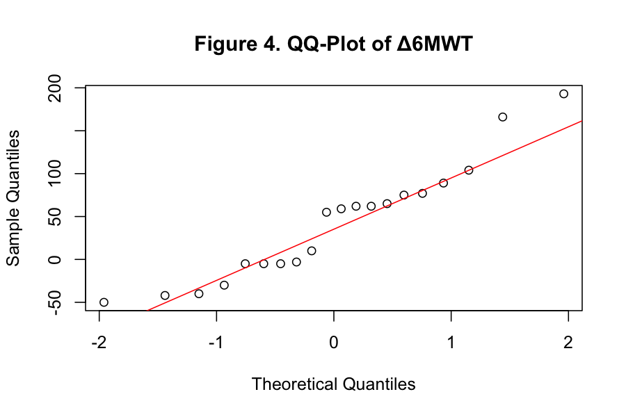
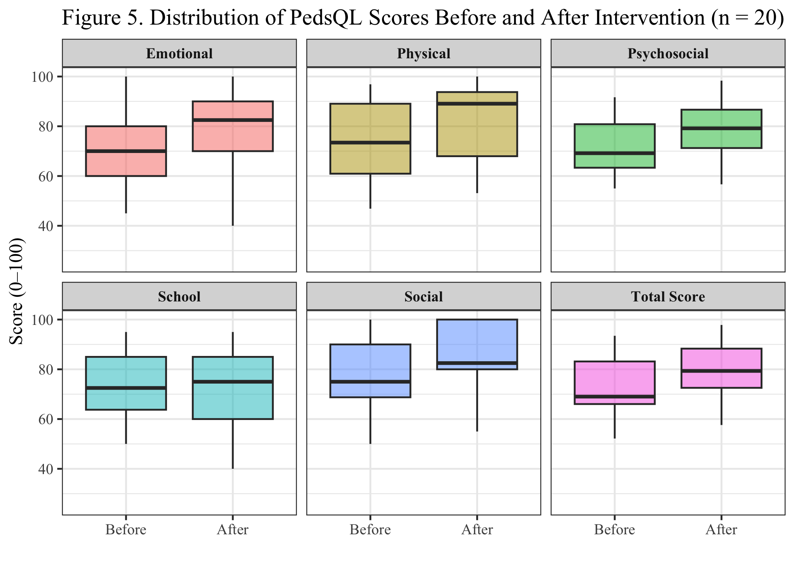
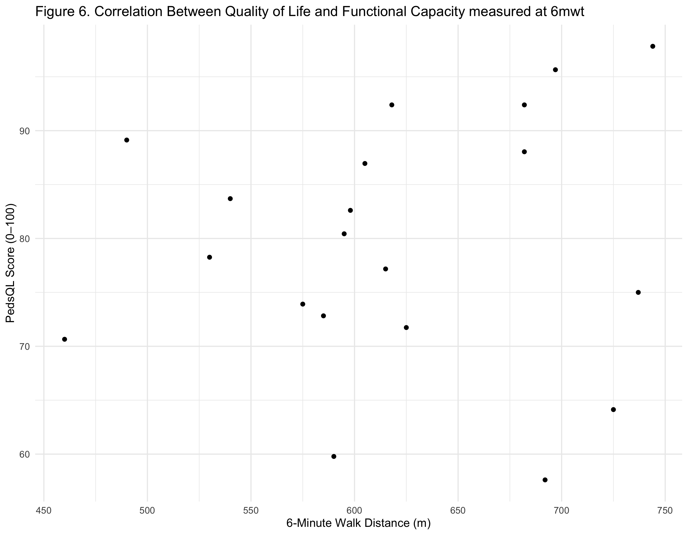

# 0. Project accessibility

The project is available on GitHub at this link: https://github.com/chloelaignel31-boop/Laignel.Chloe.git

# 1. Background and Objectives

This project presents a secondary analysis of the Marfan Power dataset (Edouard et al., 2026), focusing on functional capacity and quality of life in children with Marfan syndrome.

## 1.1. Context

Marfan syndrome (MFS) is a rare genetic disorder affecting connective tissue, mainly involving the cardiovascular, musculoskeletal, and ocular systems. Aortic dilation is the most serious complication due to the risk of dissection (Milewicz et al., 2021).

Despite improvements in life expectancy, many patients still experience reduced physical capacity and chronic fatigue, negatively impacting their health-related quality of life (Goldfinger et al., 2017).

These limitations are partly explained by decreased muscle strength and reduced exercise tolerance (Jouini et al., 2024). Adapted physical activity is known to improve these parameters and is increasingly recommended in clinical management. However, due to cardiovascular risks, exercise must be carefully prescribed and individualized in this population (Peters et al., 2001).

Evidence on structured exercise programs in children with MFS remains limited. The Marfan Power study investigated a home-based adapted physical activity program and suggested improvements in functional capacity and quality of life, despite variable adherence and missing data (Edouard et al., 2026).

**Research objective:**
To evaluate changes in functional capacity using the 6-minute walk test (6MWT) and to explore its association with quality of life in children with Marfan syndrome.

**Research question:**
Does a 6-month adapted physical activity program improve functional capacity, as assessed by the 6-minute walk test (6MWT), and is functional capacity associated with quality of life measured by the PedsQL questionnaire in pediatric patients with Marfan syndrome?

## 1.2 Aim

**The primary aim of this study was to assess changes in functional capacity following the intervention, using the 6-minute walk test (6MWT) as the primary outcome.**

The secondary aim was to explore the relationship between functional performance and quality of life, assessed using the pediatric self-reported PedsQL questionnaire.

# 2. Method

## 2.1 Study population

A total of 28 children and adolescents with Marfan syndrome were initially included in the dataset.

The inclusion and exclusion criteria used to define the study population have been previously described by Edouard et al. (2026, p. 8). The full article is available in the sources folder.

For this secondary analysis, patients were selected based on data completeness at baseline (T−3 months) and post-intervention (T+6 months) for the main variables of interest, including the 6-minute walk test (6MWT) and health-related quality of life (PedsQL).

After applying these criteria:

- **20** patients were included in the final analysis

- 8 patients were excluded due to missing data or loss to follow-up

This selection allowed within-subject comparisons in the paired statistical analysis.

## 2.2 Study design

This study is based on a secondary analysis of the Marfan Power dataset. The original study included a 3-month observation period followed by a 6-month home-based adapted physical activity program.

Timeline of the original study:

- T−3: beginning of the observation period

- T0: beginning of the intervention

- T+6: end of the intervention


Outcome measures
```{r}

```

**Primary outcome: Functional capacity, assessed using the 6-minute walk test (6MWT)**

Secondary outcome: Quality of life, assessed using the Pediatric Quality of Life Inventory (PedsQL)

The present analysis focuses on a simplified before–after comparison using data collected at:

- baseline (T−3 months)

- post-intervention (T+6 months)


## 2.3 Data analysis pipeline

A structured data processing pipeline was implemented to ensure consistency, transparency, and reproducibility.

Python (data preprocessing and exploration):

- Data cleaning

- Computation of individual changes in 6-minute walk distance (6MWT)

- Exploratory visualizations of functional capacity 

R (statistical analysis):

- Descriptive statistics and baseline comparisons

- Paired comparisons using the Wilcoxon test

- Exploratory visualization of PedsQL scores

- Correlation analysis using Spearman’s correlation

## 2.4 Statistical analysis

All statistical analyses were performed using R.

Descriptive statistics were used to summarize baseline characteristics of included and excluded patients. Continuous variables were described using mean ± standard deviation and median values, while categorical variables were presented as counts.

Between-group comparisons at baseline were performed to assess potential selection bias. Continuous variables were compared using the Mann–Whitney U test, and categorical variables using Fisher’s exact test.

Within-subject changes in functional capacity before and after the intervention were assessed using the Wilcoxon signed-rank test.

The association between functional capacity and quality of life was evaluated using Spearman’s rank correlation coefficient.

All statistical tests were two-sided, and a p-value < 0.05 was considered statistically significant.

# 3. Results

## 3.1. Study population (Section 7 of the R notebook analysis_R.Rmd)

```{r}

```

The study population was defined based on data completeness for the variables of interest at baseline (T−3) and post-intervention (T+6), resulting in the inclusion of 20 patients and the exclusion of 8 patients.

A comparison of baseline characteristics between included and excluded patients was performed to assess potential selection bias (Table 2). No statistically significant differences were observed between the two groups for any demographic or clinical variable. Similarly, sex distribution did not differ significantly between groups.

Overall, these findings indicate that included and excluded patients were comparable at baseline, suggesting that exclusions related to missing data are unlikely to have introduced significant selection bias and supporting the internal validity of the analytical sample.

## 3.2. Functional capacity (6MWT)

### 3.2.1 Data visualization and descriptive analysis (Section 8 of the Python notebook exploratory_analysis.ipynb)


```{r}

```


```{r}

```


```{r}

```


```{r}

```


Exploratory analysis of functional capacity suggests an overall increase in 6-minute walk distance following the intervention.

As shown in Figure 1, most patients increased their walking distance between baseline (T−3) and post-intervention (T+6). However, responses varied across individuals, with some patients showing little change or a decrease in performance.

The distribution of individual changes (Figures 2 and 3) was asymmetric and included both positive and negative values, suggesting a non-normal distribution. Descriptive statistics (Table 1) were consistent with these observations, showing a positive median individual change (+57.0 m), with 60% of patients improving after the intervention.

Because visual inspection suggested a non-normal distribution and the sample size was relatively small, paired comparisons were performed using the Wilcoxon signed-rank test.

Overall, these findings suggest a beneficial effect of the intervention on functional capacity.

### 3.2.2 Normality test analysis (Section 9 of the R notebook analysis_R.Rmd)
```{r}
cat(readLines("results/shapiro_test_results.txt"), sep = "\n")

```
The normality of paired differences (Δ6MWT) was explored using a Shapiro–Wilk test and QQ-plot assessment.

The Shapiro–Wilk test did not show a significant deviation from normality (W = 0.93, p = 0.16). The QQ-plot suggested an approximately normal distribution, although some deviations were observed in the upper tail, reflecting heterogeneous individual responses and a few larger improvements.

### 3.2.3 Wilcoxon test analysis and T-test analysis (Section 10 of the R notebook analysis_R.Rmd)

A paired comparison of 6-minute walk distance before and after the intervention was performed in included patients using both a paired t-test and a Wilcoxon signed-rank test.

Given the small sample size and the inter-individual variability observed in exploratory analyses, the Wilcoxon signed-rank test was retained as the primary method for statistical interpretation.

```{r}
cat(readLines("results/wilcoxon_test_results.txt"), sep = "\n")
```
```{r}
cat(readLines("results/paired_t_test_results.txt"), sep = "\n")
```


The paired Wilcoxon signed-rank test showed a significant increase in 6-minute walk distance between baseline (T−3) and post-intervention (T+6) (p = 0.016).

A paired t-test performed as a complementary parametric analysis also showed a significant improvement after intervention (t = 2.79, df = 19, p = 0.012), with a mean increase of 41.9 meters (95% CI [10.5 ; 73.2]).

These results are consistent with the graphical analysis, which showed an increase in walking distance in most patients despite some inter-individual variability.

Overall, these findings support a positive effect of the intervention on functional capacity.

## 3.3. Quality of life (PedsQL)

### 3.3.1 Data visualization and descriptive analysis (Section 11 of the R notebook analysis_R.Rmd)

```{r}

```

The boxplots show relatively high PedsQL scores across all dimensions at both time points, with moderate inter-individual variability.

Median scores tended to be higher after the intervention than at baseline, suggesting an overall improvement in perceived quality of life. The largest changes were observed in the physical and social dimensions.

However, variability between patients remained important across all domains, suggesting that perceived quality of life may be influenced by multiple factors.

Overall, this descriptive analysis suggests a general improvement in quality of life following the intervention.

### 3.3.2 Statistical analysis of the correlation between functional capacity and quality of life (Section 12 of the R notebook analysis_R.Rmd)

Spearman’s rank correlation coefficient was used as a non-parametric approach appropriate for the small sample size and the exploratory nature of the analysis.

```{r}

```


```{r}
cat(readLines("results/spearman_correlation_results.txt"), sep = "\n")
```

The relationship between functional capacity and quality of life was assessed using Spearman’s rank correlation coefficient. No significant correlation was observed between 6-minute walk distance and PedsQL score (ρ = 0.19, p = 0.43).

The graphical analysis was consistent with this result. The scatter plot showed a wide dispersion of data points without a clear monotonic pattern. Although a slight upward trend could be visually suggested, the loess smoothing curve remained relatively flat.

The broad confidence interval around the smoothing curve reflected substantial variability between patients, suggesting that functional capacity alone does not fully explain differences in perceived quality of life within this sample.

Overall, these findings suggest no clear association between 6MWT performance and quality of life following the intervention.


# 4. Conclusion

This study aimed to evaluate changes in functional capacity following an adapted physical activity intervention and to explore its relationship with quality of life in children with Marfan syndrome.

Baseline comparisons between included and excluded patients showed no significant demographic or clinical differences, suggesting a limited risk of selection bias.

Both the paired Wilcoxon signed-rank test and the paired t-test showed a significant increase in 6-minute walk distance after the intervention, supporting a positive effect on functional capacity despite some inter-individual variability in response.

The median improvement in 6MWT was +57 meters, while the paired t-test showed a mean increase of 41.9 meters after intervention.

In contrast, no significant association was found between functional capacity and quality of life, indicating that improvements in physical performance were not necessarily reflected in self-reported quality of life.

These findings suggest that adapted physical activity may improve functional capacity in pediatric patients with Marfan syndrome, while its impact on perceived quality of life remains less clear.

However, the results should be interpreted with caution due to the small sample size, inter-individual variability, and the absence of standardized pediatric measures such as BMI z-scores. Further studies with larger cohorts are needed to better understand the relationship between functional capacity and quality of life in this population.


# 5. References

Edouard, T., Bajanca, F., Flumian, C., et al. (2026). *A personalized home-based exercise training program in children with Marfan and Loeys-Dietz syndromes improves aerobic exercise capacity and health-related quality of life*.
https://pmc.ncbi.nlm.nih.gov/articles/PMC12958747/

Edouard, T., Picot, M.-C., Bajanca, F., Huguet, H., Guitarte, A., Langeois, M., Chesneau, B., Khau Van Kien, P., Garrigue, E., Dulac, Y., & Amedro, P. (2024). *Health-related quality of life in children and adolescents with Marfan syndrome or related disorders: a controlled cross-sectional study*.
https://pmc.ncbi.nlm.nih.gov/articles/PMC11059743/

Peters, K. F., Horne, R., Kong, F., Francomano, C. A., & Biesecker, B. B. (2001). *Living with Marfan syndrome II. Medication adherence and physical activity modification*.
https://pubmed.ncbi.nlm.nih.gov/11683774/

Milewicz, D. M., Braverman, A. C., De Backer, J., Morris, S. A., Boileau, C., Maumenee, I. H., Jondeau, G., Evangelista, A., & Pyeritz, R. E. (2021). *Marfan syndrome*.
https://pmc.ncbi.nlm.nih.gov/articles/PMC9261969/

Jouini, S., Milleron, O., Eliahou, L., Jondeau, G., & Vitiello, D. (2024). *Online personal training in patients with Marfan syndrome: A randomized controlled study of its impact on quality of life and physical capacity*. 
https://pmc.ncbi.nlm.nih.gov/articles/PMC11681478/

Goldfinger, J. Z., Preiss, L. R., Devereux, R. B., Roman, M. J., Hendershot, T. P., Kroner, B. L., & Eagle, K. A. (2017). *Quality of life and associated factors in patients with Marfan syndrome: The GenTAC registry*.
https://pmc.ncbi.nlm.nih.gov/articles/PMC5519341/


