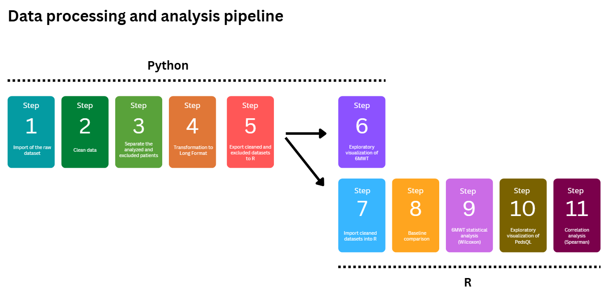

# R and Python project for Master’s internship

# Analysis of the effects of an adapted physical activity program on functional capacity assessed by the 6-minute walk test (6MWT) in children with Marfan syndrome

By Chloé Laignel-Granier

Github link : https://github.com/chloelaignel31-boop/Laignel.Chloe.git

# 1. Scientific problem

This project presents a secondary analysis of the Marfan Power dataset (Edouard et al., 2026), focusing on functional capacity and quality of life in children with Marfan syndrome.

## 1.1. Context

Marfan syndrome (MFS) is a rare genetic disorder affecting connective tissue, mainly involving the cardiovascular, musculoskeletal, and ocular systems. Aortic dilation is the most serious complication due to the risk of dissection (Milewicz et al., 2021).

Despite improvements in life expectancy, many patients still experience reduced physical capacity and chronic fatigue, negatively impacting their health-related quality of life (Goldfinger et al., 2017).

These limitations are partly explained by decreased muscle strength and reduced exercise tolerance (Jouini et al., 2024). Adapted physical activity is known to improve these parameters and is increasingly recommended in clinical management. However, due to cardiovascular risks, exercise must be carefully prescribed and individualized in this population (Peters et al., 2001).

Evidence on structured exercise programs in children with MFS remains limited. The Marfan Power study investigated a home-based adapted physical activity program and suggested improvements in functional capacity and quality of life, despite variable adherence and missing data (Edouard et al., 2026).

Research objective:
To evaluate changes in functional capacity using the 6-minute walk test (6MWT) and to explore its association with quality of life in children with Marfan syndrome.

## 1.2 Aim

The primary aim of this study was to assess changes in functional capacity following the intervention, using the 6-minute walk test (6MWT) as the primary outcome.

The secondary aim was to explore the relationship between functional performance and quality of life, assessed using the pediatric self-reported PedsQL questionnaire.

## 1.3 Method

### 1.3.1 Study design

This study is based on a secondary analysis of the Marfan Power dataset. The original study consisted of a 6-month home-based adapted physical activity program, including 3 months of observation followed by 3 months of intervention.

The present analysis focused on a simplified before–after comparison using data collected at baseline (T−3 months) and after the intervention (T+6 months).

Functional capacity was assessed using the 6-minute walk test (6MWT), and quality of life was measured using the PedsQL questionnaire. Changes were evaluated by comparing baseline and post-intervention measurements.

### 1.3.2 Study population

A total of 28 children and adolescents with Marfan syndrome were initially included in the dataset, according to the inclusion and exclusion criteria described by Edouard et al. (2026).

For this secondary analysis, patients were selected based on predefined inclusion criteria related to data completeness at baseline (T−3 months) and post-intervention (T+6 months) for the variables of interest, including the 6-minute walk test (6MWT) and health-related quality of life (PedsQL).

A total of 20 patients met these criteria and were included in the final analysis, while 8 patients were excluded. Exclusions were mainly due to loss to follow-up at T+6 or missing data for key variables.

This selection process ensured the validity of within-subject comparisons in the paired statistical analysis.

## 1.4 Data processing pipeline

Overview of the data processing and analysis pipeline: 

An overview of the data processing and analysis pipeline is presented in Figure X.

A structured workflow was implemented to ensure consistency, transparency, and reproducibility of the analyses. The pipeline clearly separates data preprocessing and exploratory analysis performed in Python from statistical analyses conducted in R.

### 1.4.1 Python: data preprocessing and exploratory analysis

The raw dataset (Marfan.xlsx) was first imported into Python.

Data preprocessing included cleaning procedures, verification of data quality, and selection of patients based on data completeness. Included and excluded patients were identified according to predefined criteria.

The dataset was then transformed into a suitable format for analysis, and individual changes (Δ) in 6-minute walk distance (6MWT) were computed.

Exploratory data analysis was performed using graphical representations (boxplots, individual trajectories, and histograms) to assess data distribution and visualize individual changes.

Finally, cleaned and excluded datasets were exported for subsequent statistical analysis in R.

### 1.4.2 R: statistical analysis

The cleaned datasets were imported into R for statistical analysis.

Descriptive statistics were computed to summarize the data, and baseline characteristics of included and excluded patients were compared to assess the potential risk of selection bias.

Changes in functional capacity were analyzed using a paired Wilcoxon signed-rank test.

In addition, quality of life scores (PedsQL) were explored using graphical representations.

Finally, the relationship between functional capacity and quality of life was assessed using Spearman’s correlation.#

# 2. How to run the project

## 2.1 Python preprocessing and exploratory analysis

Open and run the Python notebook: exploratory_analysis.ipynb

This step performs data preprocessing and exploratory analysis, and generates the following outputs in the /figures folder:

- Figure 1. Changes in 6-Minute Walk Distance Before and After Intervention
- Figure 2. Boxplot of Changes in 6-Minute Walk Distance
- Figure 3. Histogram of Individual Changes in the 6-Minute Walk Test
- Table 1. Distribution and changes in 6-minute walk distance

It also exports the processed datasets for statistical analysis in the /data folder:

- data_clean.xlsx (included patients)
- data_excluded.xlsx (excluded patients)

## 2.2 Statistical analysis in R

Open and run the R notebook : analysis_R.Rmd

This step performs statistical analyses and generates the following outputs in the /figures folder:

- Table 2. Comparison of included and excluded patients at baseline
- Figure 4. Distribution of PedsQL Scores Before and After Intervention
- Figure 5. Correlation between quality of life and functional capacity (6MWT)

Statistical results are saved in the /results folder:

- Wilcoxon test results
- Spearman correlation results

Open and knit Laignel_Chloe.Rmd to produce the final HTML report (Laignel_Chloe.html).

# 3. Project structure

data/ : Raw dataset (Marfan.xlsx) and processed datasets (data_clean.xlsx, data_excluded.xlsx)

figures/ : All generated figures and tables

notebooks/ : exploratory_analysis.ipynb (Python) and analysis_R.Rmd (R)

results/ : Statistical outputs (Wilcoxon test and Spearman correlation)

Laignel_Chloe.Rproj : RStudio project file

Laignel_Chloe.Rmd: Final R Markdown file

Laignel_Chloe.html: Final project report

# 4. Data organization

Marfan.xlsx

The dataset contains data from children and adolescents with Marfan syndrome included in the Marfan Power study.

Each row corresponds to one participant and includes demographic, anthropometric, functional, and quality of life variables collected at:

- baseline (T−3 months)
- post-intervention (T+6 months)

**Main variables**

Demographic and anthropometric data:

- id: Participant identifier
- age: Age at inclusion (years)
- weight_kg: Body weight at inclusion (kg)
- height_cm: Height at inclusion (cm)
- bmi_kg_cm2: Body mass index at inclusion (kg/m²)

**Functional capacity (6MWT)**

- 6minwt_distance_traveled_m_before: Distance at baseline (m)
- 6minwt_distance_traveled_m_after: Distance post-intervention (m)

Cardiorespiratory parameter:
- vat_before: Ventilatory anaerobic threshold at baseline (% predicted)
- vat_after: Ventilatory anaerobic threshold post-intervention (% predicted)

**Quality of life (PedsQL – self-reported)**

Scores range from 0 to 100 (higher = better quality of life)

- pedsql_totalself_before / after: Total score
- pedsql_physiqueself_before / after: Physical dimension
- pedsql_psycosocialself_before / after: Psychosocial dimension
- pedsql_emotionself_before / after: Emotional dimension
- pedsql_relationself_before / after: Social dimension
- pedsql_ecoleself_before / after: School dimension

# 5. Requirements

## 5.1 Python libraries

- pandas
- numpy
- matplotlib
- seaborn

## 5.2 R packages

- readxl
- dplyr
- gridExtra

# 6. Conclusion

The analysis of functional capacity and quality of life in children with Marfan syndrome shows that:

Functional capacity significantly improved after the intervention, as indicated by the Wilcoxon signed-rank test (V = 170, p = 0.016), although inter-individual variability was observed.
The association between functional capacity and quality of life was weak and not statistically significant (Spearman’s rho = 0.19, p = 0.43).
Overall, the adapted physical activity program appears to improve functional capacity, while its impact on quality of life remains uncertain.

These results should be interpreted with caution due to the relatively small sample size.

# 7. References

Edouard, T., Bajanca, F., Flumian, C., et al. (2026). *A personalized home-based exercise training program in children with Marfan and Loeys-Dietz syndromes improves aerobic exercise capacity and health-related quality of life*.
https://pmc.ncbi.nlm.nih.gov/articles/PMC12958747/

Edouard, T., Picot, M.-C., Bajanca, F., Huguet, H., Guitarte, A., Langeois, M., Chesneau, B., Khau Van Kien, P., Garrigue, E., Dulac, Y., & Amedro, P. (2024). *Health-related quality of life in children and adolescents with Marfan syndrome or related disorders: a controlled cross-sectional study*.
https://pmc.ncbi.nlm.nih.gov/articles/PMC11059743/

Peters, K. F., Horne, R., Kong, F., Francomano, C. A., & Biesecker, B. B. (2001). *Living with Marfan syndrome II. Medication adherence and physical activity modification*.
https://pubmed.ncbi.nlm.nih.gov/11683774/

Milewicz, D. M., Braverman, A. C., De Backer, J., Morris, S. A., Boileau, C., Maumenee, I. H., Jondeau, G., Evangelista, A., & Pyeritz, R. E. (2021). *Marfan syndrome*.
https://pmc.ncbi.nlm.nih.gov/articles/PMC9261969/

Jouini, S., Milleron, O., Eliahou, L., Jondeau, G., & Vitiello, D. (2024). *Online personal training in patients with Marfan syndrome: A randomized controlled study of its impact on quality of life and physical capacity*. 
https://pmc.ncbi.nlm.nih.gov/articles/PMC11681478/

Goldfinger, J. Z., Preiss, L. R., Devereux, R. B., Roman, M. J., Hendershot, T. P., Kroner, B. L., & Eagle, K. A. (2017). *Quality of life and associated factors in patients with Marfan syndrome: The GenTAC registry*.
https://pmc.ncbi.nlm.nih.gov/articles/PMC5519341/

